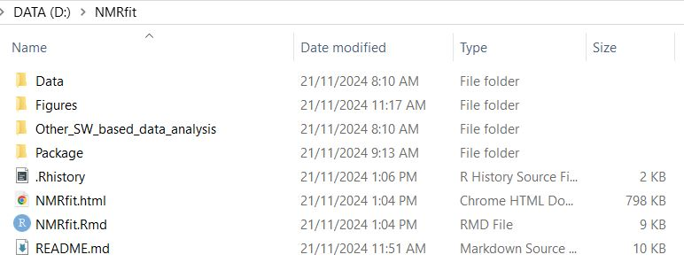
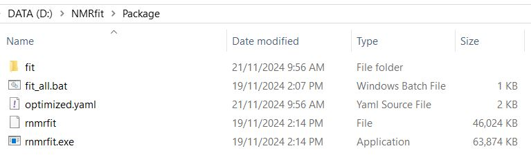
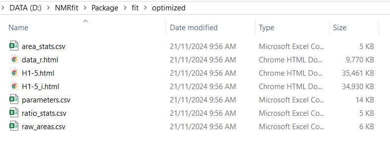

# NMRfit

## Overview

NMRfit is a software package for fitting NMR data using customizable YAML configuration files. It processes data files and outputs results in a user-specified format.

NMRfit is a command-line package specifically designed for peak fitting and analysis of NMR spectra and supports both Windows and Linux platforms, enabling users to process and fit data with ease.

---
  
## Folder Structure
  
- **`Data/`**: Contains raw or processed data files.
- **`Figures/`**: Figures and images for documentation or analysis.
- **`Other_SW_based_data_analysis/`**: Holds supplementary data analysis results.
- **`Package/`**: Core files necessary for running the software:
  - `fit_all.bat`: Batch script to process all YAML files in the current directory.
  - `optimized.yaml`: Example YAML configuration file with parameters and dataset definitions.
  - `rnmrfit`: Script or binary for analysis (primarily for UNIX-based systems).
  - `rnmrfit.exe`: Main executable for the software (Windows).
  
- **`README.md`**: Documentation for the software package.



<p align="center"><strong><em>Fig.1. Files and Folders</em></strong></p>


")
<p align="center"><strong><em>Fig.2. Data Folders (Highlighted folders will be analyzed in below example)</em></strong></p>


---


## Package Contents
  
### 1. `fit_all.bat`
  A batch script designed for Windows to process all `.yaml` files in the `Package` directory. The script uses PowerShell to execute the NMRfit software:
  
  ```bat
start powershell -command "& '.\rnmrfit.exe' *.yaml -o fit"
```

- **Usage**: Double-click the script or run it in a command prompt from the `Package` directory.
- **Output**: Results are saved in the specified output directory (e.g., `fit`).

### 2. `optimized.yaml`
This is an example configuration file that defines parameter settings, datasets, species, and processing options for the NMRfit software.



<p align="center"><strong><em>Fig.3. Files in Package folder</em></strong></p>


---
## YAML file settings key Sections

- **`processing`**:
  - `zf`: Zero filling factor.
  - `lb`: Line broadening parameter.
  - `phase`: Enables phase correction.
  - `reference`: Sets reference ppm and threshold values.

- **`parameters`**:
  - Defines fitting parameters, such as peak width and fraction.

- **`general_bounds`**:
  - `width`: Specifies general bounds for peak width.

- **`offset_bounds`**:
  - `position`: Adjusts peak position.
  - `height`: Modifies peak height.

- **`ranges`**:
  - Defines cutoff for data processing.

- **`baseline`**:
  - Specifies baseline correction with span and polynomial degree.

- **`phase`**:
  - Sets phase order and bounds.

- **Datasets**:
  Each dataset corresponds to a specific sample path:
  
  ```yaml
  dataset: "1"
  path: "./2H-VAN-1"
  ```

- **Species and Resonances**:
  Defines chemical species and their respective resonances:
  ```yaml
  species: "vanillin"
  resonances: 
    "9.82 s": H1
  "8.29 s": H2
  ```

- **Plotting**:
  Configures plots for data visualization:
  ```yaml
  plot: "H1-5"
  ppm: [0, 12]
  experiments: "*"
  species: "*"
  ```

- **Area Calculations**:
  Calculates area statistics, normalizations, and summaries:
  ```yaml
  calculate_areas: "ratio_stats"
  sum_by: "resonance"
  normalize_by: "TMU::2.82 s"
  ```

---
  
## Usage

### To Run the Software:
  
**On Windows:**
 
  1. Open a Command Prompt or double-click `fit_all.bat` in the `Package` directory.
  2. Alternatively, execute manually:
  
  ```cmd
rnmrfit.exe <path_to_yaml_file>
  ```

**On Linux:**
 
  1. Ensure `rnmrfit` is executable:
  
  ```bash
chmod +x rnmrfit
```
  2. Run the command:
  
  ```bash
./rnmrfit <path_to_yaml_file>
  ```

---
  
### YAML Configuration Details
  
Modify `optimized.yaml` to customize the software’s behavior:
  
- **Input Datasets**:
  Define each dataset's path and label.
- **Species and Resonances**:
  List compounds and their expected resonance frequencies.
- **Fitting Parameters**:
  Adjust bounds and parameters for peak fitting.
- **Baseline Correction**:
  Fine-tune baseline correction using span and degree settings.
- **Area Calculations**:
  Specify the normalization method and summarization options.


---

## Output Files
  
When the software is executed, the results will be saved in the `Package/fit/optimized/` directory. 


<p align="center"><strong><em>Fig.4. Output files</em></strong></p>


Below is a description of the output files generated:
  
- **`ratio_stats.csv`**: 
  - Contains calculated area ratios for specified resonances.
  - Used for normalization and summarization purposes.

- **`raw_areas.csv`**: 
  - Provides raw area values for each resonance in the dataset.
  - Useful for further manual analysis or custom calculations.

- **`area_stats.csv`**: 
  - Summarizes the area calculations across datasets.
  - Includes statistical metrics for resonance areas.

- **`data_r.html`**: 
  - An interactive plot of the raw data.
- Allows visualization of resonance peaks and overall dataset trends.

- **`H1-5.html`**: 
  - HTML file with a plot focusing on specific resonances (e.g., H1 to H5).
  - Displays the range `[0, 12] ppm` for all experiments and species.

- **`H1-5_i.html`**: 
  - Interactive plot displaying individual components of the H1-H5 resonances.
  - Useful for detailed peak analysis.

- **`parameters.csv`**: 
  - Lists all parameter settings used during the fit.
  - Includes bounds, widths, and any adjustments made.


---

## Example Workflow

1. Place your NMR data files in the `Data` directory.
2. Update the `optimized.yaml` file with your datasets and desired parameters.
3. Run the software:
   - On Windows: Double-click `fit_all.bat` or use `rnmrfit.exe`.
   - On Linux: Use `rnmrfit`.
4. Check the results in the output directory.

---

## FAQs